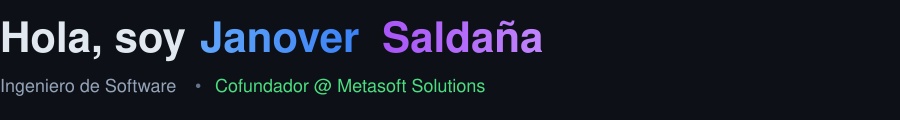
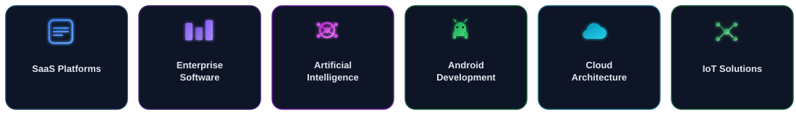
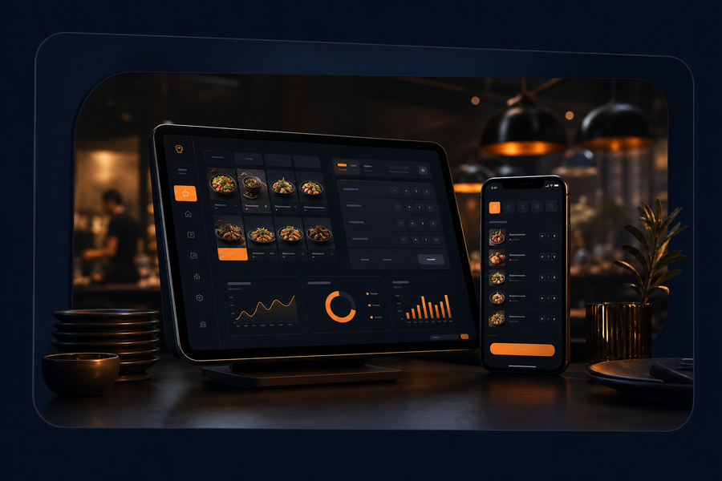
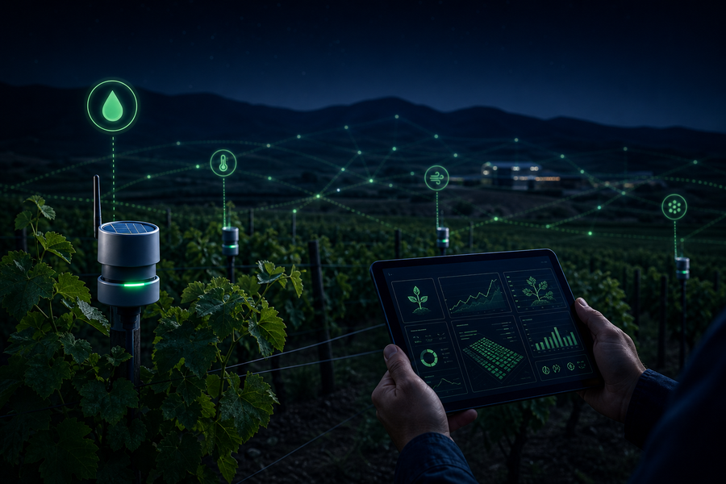
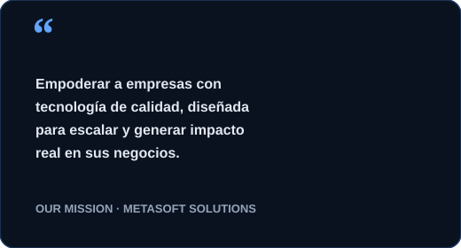
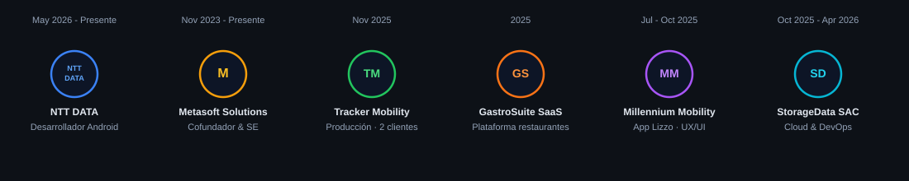

  

<table>
  <tr>
    <td width="58%" valign="middle">

Building software that solves real-world problems through scalable architectures, AI and modern cloud technologies.

 

</td>
    <td width="42%" align="center" valign="middle">
      
    </td>
  </tr>
</table>

---

## What I'm Building

  

---

## Featured Products

<table>
  <tr>
    <td width="20%" valign="top" align="center">
      
       
      <strong>Tracker Mobility</strong> 
      
      

        Plataforma de verificación vehicular de punta a punta: del alta en panel al resultado con IA en campo.
          
        • Vue.js 
        • Spring Boot 
        • PostgreSQL 
        • OpenAI
          
        📊 Órdenes con historial + IA
      

    </td>
    <td width="20%" valign="top" align="center">
      
       
      <strong>GastroSuite</strong> 
      
      

        Plataforma SaaS para restaurantes: operaciones, pedidos y gestión del día a día en un solo lugar.
          
        • Vue.js 
        • ASP.NET Core 
        • SQL Server 
        • Redis
          
        🍽️ En desarrollo activo
      

    </td>
    <td width="20%" valign="top" align="center">
      
       
      <strong>Plataforma de Planta</strong> 
      
      

        Control de accesos en planta corporativa con alertas en tiempo real a WhatsApp.
          
        • Angular 
        • Spring Boot 
        • MySQL 
        • WhatsApp API
          
        🏭 Millennium Access Control
      

    </td>
    <td width="20%" valign="top" align="center">
      
       
      <strong>CropGuardian</strong> 
      
      

        Solución IoT para monitoreo agrícola: sensores, alertas y dashboard de campo.
          
        • Flutter 
        • Spring Boot 
        • MQTT / IoT 
        • Cloud
          
        🌱 En prueba piloto
      

    </td>
    <td width="20%" valign="top" align="center">
      
       
      <strong>Lizzo App</strong> 
      
      

        App móvil de leasing vehicular: pagos, financiamiento y cuenta — diseño UX/UI validado.
          
        • Flutter 
        • Kotlin 
        • Figma 
        • Jetpack Compose
          
        📱 Millennium Mobility
      

    </td>
  </tr>
</table>

---

## Building Metasoft Solutions

<table>
  <tr>
    <td width="55%" valign="top">

### Leading digital transformation

Como co-fundador de **Metasoft Solutions**, lidero el diseño y desarrollo de software a medida para empresas que necesitan modernizar operaciones, reducir fricción y escalar con tecnología propia.

Participo en el ciclo completo: discovery, arquitectura, desarrollo, despliegue y acompañamiento post-lanzamiento.

  

</td>
    <td width="45%" align="center" valign="top">

### Our Mission

 

</td>
  </tr>
</table>

---

## Professional Journey

  

| Period | Company / Project | Role |
|:-------|:------------------|:-----|
| **May 2026 – Presente** | NTT DATA | Android Developer |
| **Nov 2023 – Presente** | Metasoft Solutions | Co-founder & Software Engineer |
| **Nov 2025** | Tracker Mobility | Producción · 2 clientes |
| **2025** | GastroSuite SaaS | Plataforma para restaurantes |
| **Jul – Oct 2025** | Millennium Mobility | App Lizzo · Frontend UX/UI |
| **Oct 2025 – Apr 2026** | StorageData SAC | Cloud & DevOps · Huawei Cloud |

---

## Tech Stack

<table>
  <tr>
    <td valign="top" width="16%">

#### Backend
 
Java · Spring Boot  
 
ASP.NET Core

</td>
    <td valign="top" width="16%">

#### Frontend
 
Vue.js · Angular 
TypeScript

</td>
    <td valign="top" width="16%">

#### Mobile
 
Flutter · Kotlin 
Jetpack Compose

</td>
    <td valign="top" width="16%">

#### Database
 
MySQL · SQL Server 
Redis

</td>
    <td valign="top" width="16%">

#### Cloud & DevOps
 
Docker · DigitalOcean 
Huawei Cloud

</td>
    <td valign="top" width="16%">

#### Architecture
🏗️ **DDD** 
📐 **Clean Architecture** 
🧩 **SOLID** 
🔐 **JWT · RBAC · OpenAPI**

</td>
  </tr>
</table>

  

---

## Engineering Philosophy & 2026 Roadmap

<table>
  <tr>
    <td width="45%" valign="top">

### Engineering Philosophy

El valor del software **no se mide en líneas de código**, sino en el **impacto** que genera en el negocio y en las personas que lo usan.

Construyo soluciones con **arquitectura limpia**, enfocadas en escalabilidad, mantenibilidad y resultados reales — no en complejidad innecesaria.

</td>
    <td width="55%" valign="top">

### 🎯 2026 Roadmap

- [x] Escalar **GastroSuite** hacia más restaurantes
- [x] Certificarme en **AWS**
- [x] Construir productos con **IA** aplicada
- [x] Fortalecer arquitectura **cloud** (Huawei / DO)
- [x] Mejorar DX y calidad en entregas Metasoft
- [x] Contribuir a **Open Source**
- [x] Profundizar en **Android** (NTT DATA)
- [x] Llevar más productos de Metasoft a **producción**

</td>
  </tr>
</table>

---

## Connect

  
  
  
  

  💻 Building software that matters · Made with ❤️ from Lima, Perú

