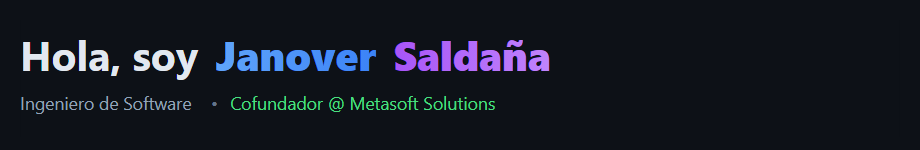
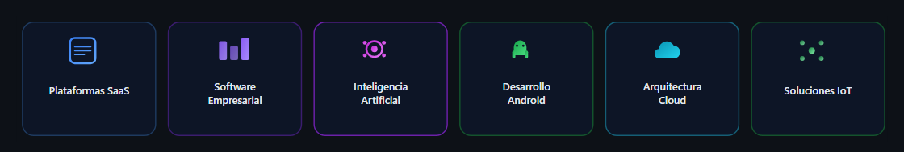
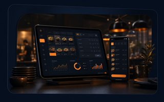
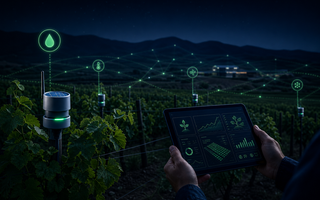
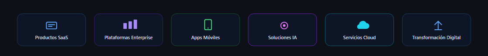
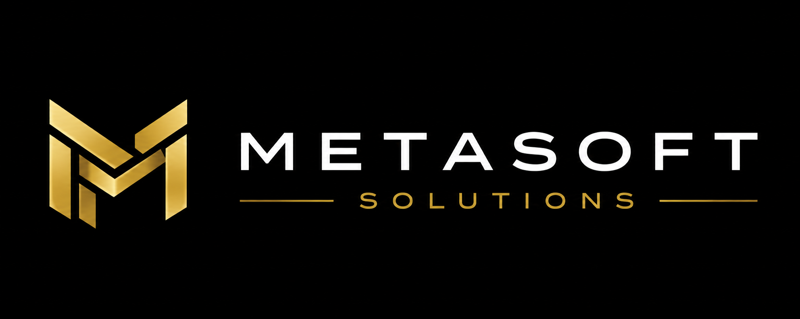
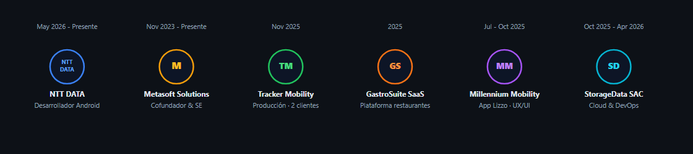

<!--
  GitHub permite HTML limitado (tablas, img, a, p, strong…).
  El CSS casi no funciona: GitHub elimina style/class en el README.
  Por eso usamos HTML para la estructura y SVG/PNG solo para colores e ilustraciones.
-->

<table width="100%">
  <tr>
    <td width="58%" valign="middle">
      
       
      

        Construyo software que resuelve problemas reales con arquitecturas escalables, inteligencia artificial y tecnologías cloud modernas.
      

      

        
        &nbsp;
        
        &nbsp;
        
      

    </td>
    <td width="42%" align="center" valign="middle">
      
    </td>
  </tr>
</table>

---

## En qué estoy construyendo

  

---

## Productos destacados

<table width="100%">
  <tr>
    <td width="20%" valign="top" align="center">
      
        
      <strong>Tracker Mobility</strong> 
      
      

        Verificación vehicular de punta a punta, con resultados generados por IA a partir de la visita en campo.
          
        • Vue.js 
        • Spring Boot 
        • PostgreSQL 
        • OpenAI
          
        Órdenes con historial + IA
      

    </td>
    <td width="20%" valign="top" align="center">
      
        
      <strong>GastroSuite</strong> 
      
      

        Plataforma SaaS para restaurantes: operaciones, pedidos y gestión del día a día en un solo lugar.
          
        • Vue.js 
        • ASP.NET Core 
        • SQL Server 
        • Redis
          
        En desarrollo activo
      

    </td>
    <td width="20%" valign="top" align="center">
      
        
      <strong>Plataforma de Planta</strong> 
      
      

        Control de accesos en planta corporativa con alertas en tiempo real hacia WhatsApp.
          
        • Angular 
        • Spring Boot 
        • MySQL 
        • WhatsApp API
          
        Millennium Access Control
      

    </td>
    <td width="20%" valign="top" align="center">
      
        
      <strong>CropGuardian</strong> 
      
      

        Solución IoT para monitoreo agrícola: sensores, alertas y dashboard de campo.
          
        • Flutter 
        • Spring Boot 
        • MQTT / IoT 
        • Cloud
          
        En prueba piloto
      

    </td>
    <td width="20%" valign="top" align="center">
      
        
      <strong>Lizzo App</strong> 
      
      

        App de leasing vehicular: pagos, financiamiento y cuenta — diseño UX/UI validado.
          
        • Flutter 
        • Kotlin 
        • Figma 
        • Jetpack Compose
          
        Millennium Mobility
      

    </td>
  </tr>
</table>

---

## Construyendo Metasoft Solutions

<table width="100%">
  <tr>
    <td width="58%" valign="top">
      <h3>Liderando la transformación digital</h3>
      

        Como cofundador de <strong>Metasoft Solutions</strong>, lidero el diseño y desarrollo de software a medida para empresas que necesitan modernizar operaciones, reducir fricción y escalar con tecnología propia.
      

      

        Participo en el ciclo completo: discovery, arquitectura, desarrollo, despliegue y acompañamiento post-lanzamiento.
      

      

        
      

    </td>
    <td width="42%" align="center" valign="middle">
      <h3>Nuestra misión</h3>
      <blockquote align="left">
        

          <em>« Empoderar a empresas con tecnología de calidad, diseñada para escalar y generar impacto real en sus negocios. »</em>
        

      </blockquote>
       
      
    </td>
  </tr>
</table>

---

## Trayectoria profesional

  

<table width="100%">
  <thead>
    <tr>
      <th align="left">Periodo</th>
      <th align="left">Empresa / Proyecto</th>
      <th align="left">Rol</th>
    </tr>
  </thead>
  <tbody>
    <tr>
      <td><strong>May 2026 – Presente</strong></td>
      <td>NTT DATA</td>
      <td>Desarrollador Android</td>
    </tr>
    <tr>
      <td><strong>Nov 2023 – Presente</strong></td>
      <td>Metasoft Solutions</td>
      <td>Cofundador e Ingeniero de Software</td>
    </tr>
    <tr>
      <td><strong>Nov 2025</strong></td>
      <td>Tracker Mobility</td>
      <td>Producción · 2 clientes</td>
    </tr>
    <tr>
      <td><strong>2025</strong></td>
      <td>GastroSuite SaaS</td>
      <td>Plataforma para restaurantes</td>
    </tr>
    <tr>
      <td><strong>Jul – Oct 2025</strong></td>
      <td>Millennium Mobility</td>
      <td>App Lizzo · Frontend UX/UI</td>
    </tr>
    <tr>
      <td><strong>Oct 2025 – Abr 2026</strong></td>
      <td>StorageData SAC</td>
      <td>Cloud y DevOps · Huawei Cloud</td>
    </tr>
  </tbody>
</table>

---

## Stack tecnológico

<table width="100%">
  <tr>
    <td valign="top" width="16%" align="left">
      <h4>Backend</h4>
       
      Java · Spring Boot  
       
      ASP.NET Core
    </td>
    <td valign="top" width="16%" align="left">
      <h4>Frontend</h4>
       
      Vue.js · Angular 
      TypeScript
    </td>
    <td valign="top" width="16%" align="left">
      <h4>Móvil</h4>
       
      Flutter · Kotlin 
      Jetpack Compose
    </td>
    <td valign="top" width="16%" align="left">
      <h4>Base de datos</h4>
       
      MySQL · SQL Server 
      Redis
    </td>
    <td valign="top" width="16%" align="left">
      <h4>Cloud y DevOps</h4>
       
      Docker · DigitalOcean 
      Huawei Cloud
    </td>
    <td valign="top" width="16%" align="left">
      <h4>Arquitectura</h4>
      🏗️ DDD 
      📐 Clean Architecture 
      🧩 SOLID 
      🔐 JWT · RBAC · OpenAPI
    </td>
  </tr>
</table>

  

---

## Filosofía de ingeniería y roadmap 2026

<table width="100%">
  <tr>
    <td width="48%" valign="top">
      <h3>Filosofía de ingeniería</h3>
      

        El valor del software <strong>no se mide en líneas de código</strong>, sino en el <strong>impacto</strong> que genera en el negocio y en las personas que lo usan.
      

      

        Construyo soluciones con <strong>arquitectura limpia</strong>, enfocadas en escalabilidad, mantenibilidad y resultados reales — no en complejidad innecesaria.
      

    </td>
    <td width="52%" valign="top">
      <h3>🎯 Roadmap 2026</h3>
      <ul>
        <li>Escalar <strong>GastroSuite</strong> hacia más restaurantes</li>
        <li>Certificarme en <strong>AWS</strong></li>
        <li>Construir productos con <strong>IA</strong> aplicada</li>
        <li>Fortalecer arquitectura <strong>cloud</strong> (Huawei / DigitalOcean)</li>
        <li>Mejorar DX y calidad en las entregas de Metasoft</li>
        <li>Contribuir a <strong>Open Source</strong></li>
        <li>Profundizar en <strong>Android</strong> (NTT DATA)</li>
        <li>Llevar más productos de Metasoft a <strong>producción</strong></li>
      </ul>
    </td>
  </tr>
</table>

---

## Contacto

  
  
  
  

  💻 Construyendo software con impacto · Hecho con ❤️ desde Lima, Perú

