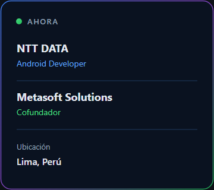
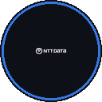
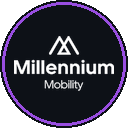

<table width="100%">
  <tr>
    <td width="64%" valign="middle">
      <h2>Hola, soy</h2>
      
       
      
      

        Diseño y construyo software en producción: SaaS, apps móviles, cloud e IA
        aplicada a operaciones reales. Del discovery a producción, con arquitectura
        escalable e impacto medible.
      

      

        
        
        
      

    </td>
    <td width="36%" align="center" valign="middle">
      
    </td>
  </tr>
</table>

  
  

---

## Enfoque

  

---

## Impacto en producción

<table width="100%">
  <tr>
    <td width="33%" valign="top" align="center">
      
        
      <strong>Tracker Mobility</strong>
      &nbsp;
      

        Verificación vehicular de punta a punta con resultados generados por IA.
          
        Vue.js · Spring Boot · PostgreSQL · OpenAI
      

    </td>
    <td width="34%" valign="top" align="center">
      
        
      <strong>Plataforma de Planta</strong>
      &nbsp;
      

        Control de accesos en planta con alertas en tiempo real a WhatsApp.
          
        Angular · Spring Boot · MySQL · WhatsApp API
      

    </td>
    <td width="33%" valign="top" align="center">
      
        
      <strong>Lizzo App</strong>
      &nbsp;
      

        App de leasing vehicular: pagos, financiamiento y cuenta — flujos validados.
          
        Flutter · Kotlin · Figma · Jetpack Compose
      

    </td>
  </tr>
</table>

  
<strong>Más productos en curso</strong>

   
  <table width="100%">
    <tr>
      <td width="50%" valign="top">
        <strong>GastroSuite</strong>
        &nbsp; 
        Plataforma para operaciones de restaurantes. 
        Vue.js · ASP.NET Core · SQL Server · Redis
      </td>
      <td width="50%" valign="top">
        <strong>CropGuardian</strong>
        &nbsp; 
        Monitoreo agrícola con sensores y alertas de campo. 
        Flutter · Spring Boot · MQTT · Cloud
      </td>
    </tr>
  </table>

---

## Metasoft Solutions

<table width="100%">
  <tr>
    <td width="65%" valign="middle">
      <blockquote>
        

          <em>« Empoderar a empresas con tecnología de calidad, diseñada para escalar y generar impacto real en sus negocios. »</em>
        

      </blockquote>
      

        Como cofundador lidero el ciclo completo: discovery → arquitectura → desarrollo → producción.
      

    </td>
    <td width="35%" align="center" valign="middle">
      
    </td>
  </tr>
</table>

---

## Trayectoria

<table width="100%">
  <tr>
    <td width="16%" align="center" valign="top">
      May 2026 – Hoy  
        
      <strong>NTT DATA</strong> 
      Android
    </td>
    <td width="17%" align="center" valign="top">
      Nov 2023 – Hoy  
        
      <strong>Metasoft</strong> 
      Cofundador
    </td>
    <td width="16%" align="center" valign="top">
      2025  
        
      <strong>Tracker</strong> 
      Producción
    </td>
    <td width="17%" align="center" valign="top">
      2025  
        
      <strong>GastroSuite</strong> 
      SaaS
    </td>
    <td width="17%" align="center" valign="top">
      Jul–Oct 2025  
        
      <strong>Millennium</strong> 
      UX/UI Lizzo
    </td>
    <td width="17%" align="center" valign="top">
      Oct 2025–Abr 2026  
        
      <strong>StorageData</strong> 
      Cloud / DevOps
    </td>
  </tr>
</table>

---

## Stack

  

  
    <strong>Backend</strong> Java · Spring Boot · ASP.NET Core &nbsp;·&nbsp;
    <strong>Frontend</strong> Vue.js · Angular · TypeScript &nbsp;·&nbsp;
    <strong>Móvil</strong> Flutter · Kotlin · Jetpack Compose &nbsp;·&nbsp;
    <strong>Arquitectura</strong> DDD · Clean · SOLID · JWT/RBAC/OpenAPI
  

---

## Roadmap 2026

<table width="100%">
  <tr>
    <td width="33%" valign="top">
      Escalar <strong>GastroSuite</strong> y llevar más productos Metasoft a producción
    </td>
    <td width="34%" valign="top">
      Certificación <strong>AWS</strong> y profundizar <strong>Android</strong> en NTT DATA
    </td>
    <td width="33%" valign="top">
      Productos con <strong>IA aplicada</strong> y contribución a Open Source
    </td>
  </tr>
</table>

---

  
  
  
  

